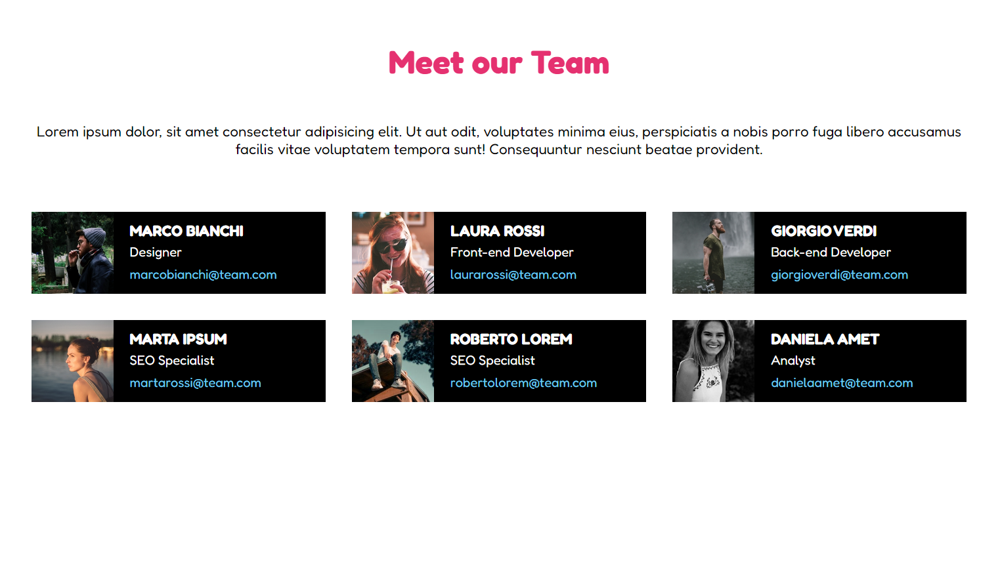

# Our Team

This is the 19th exercise I have completed as part of the web development master. It focuses on dynamically generating UI components (cards) by iterating over an array of team member objects and rendering their information on the webpage.
Repository name: `js-our-team`

## 📝 Task
Given a pre-defined array of objects representing company team members, create a dedicated webpage that dynamically displays a custom card for each single component.

### 🌟 Bonus
* Make the application layout fully responsive, allowing cards to wrap neatly onto new rows on smaller screens.
* Implement an interactive "Add Member" form that dynamically inserts a new member object into the view with custom details and an image.

## 📷 Reference Webpage


## 📂 Project Structure
```text
js-our-team/
│
├── assets/
│   ├── img/
│   │   ├── AAA8.jpeg
│   │   ├── female1.png
│   │   ├── female2.png
│   │   ├── female3.png
│   │   ├── male1.png
│   │   ├── male2.png
│   │   └── male3.png
│   └── screenshot.png
│
├── scripts/
│   ├── database.js
│   └── main.js
│
├── index.html
├── README.md
└── style.css
```
## 🛠️ Technologies Used
* HTML5: Semantic structure.
* CSS3: Custom styling and layout.
* JavaScript (ES6): Logic, data processing, and DOM manipulation.
* VSCode: IDE.
